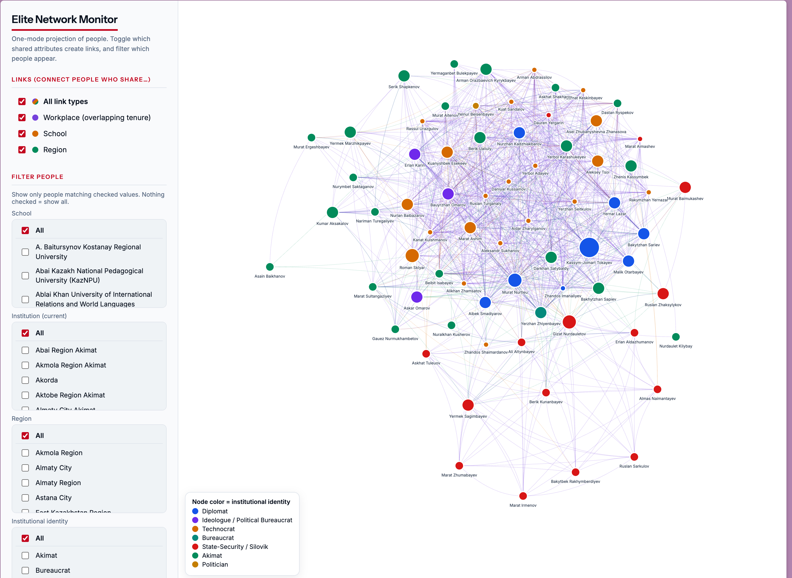

# Kazakh Elite Tracker

**https://erlan-bg.github.io/Kazakh-Elite-Tracker/**

An interactive network map of Kazakhstan's political elite. Connected by the career, educational, and regional ties that the
Central Asia literature treats as the skeleton of patronage politics. Toggle
which shared attributes draw links, filter who appears, click any node for a
full sourced career history. 

## Why these ties

A formal org chart tells you little about how power works in Kazakhstan;
scholars of the region argue that politics runs through informal networks
built on shared careers, schools, and home regions. This tool attempts to operationalizes that claim:
each link type is one hypothesized channel of affiliation, and each can be
switched on or off independently to see which structure it produces.

- **Workplace (overlapping tenure)** — the strictest tie. Two people are linked
  only if they served at the *same institution at the same time*: their career
  stints must share at least one calendar year (boundary years count; `Present`
  runs through the current year). Same employer in disjoint eras — KNB
  1997–2001 vs. KNB 2007–2017 — does **not** connect. Embassies and other
  foreign postings are distinct institutions from the MFA headquarters, so an
  ambassador abroad does not link to ministry staff at home.
- **School** — a shared alma mater, the classic site of early network
  formation.
- **Region** — a shared birth region, the standard observable proxy for
  regional patronage affiliation.

Node color encodes an **institutional identity** coding (diplomat, technocrat,
bureaucrat, ideologue, state-security/silovik, akimat, politician) assigned
from each person's dominant career track.

Career histories are compiled from official biographies (Akorda, ministry and
akimat sites) and public reporting. 

## Limitations, stated plainly

- **Informal ties are invisible.** Family, marriage, and business relationships
  — arguably the most important elite ties in Kazakhstan — do not appear in
  official biographies and are not captured here. Co-tenure is a *proxy* for
  acquaintance, not proof of alliance.
  
- **Coarse time resolution.** Tenure is recorded in years, so two officials who
  overlapped for one month in the same calendar year still link.

## Roadmap

- Time slider: replay the network year by year, before and after January 2022.
- Expand
